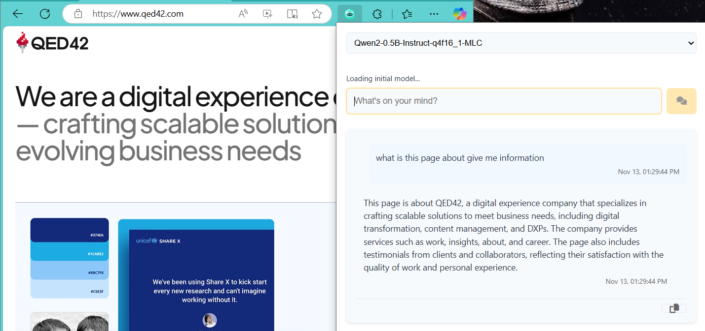
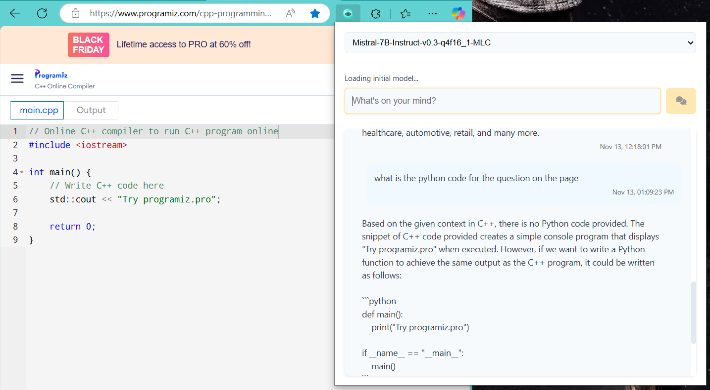
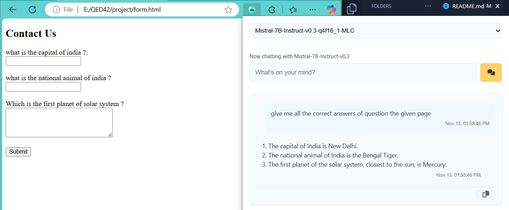
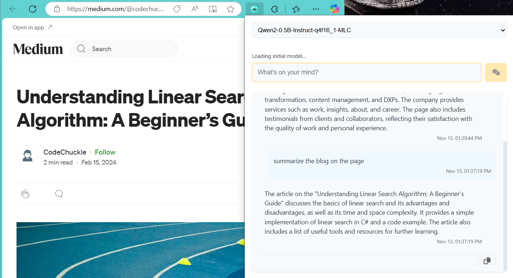

# On-Device LLM GenAI Internship Take-Home Assignment 🤖💻

## Overview 📝
This project is a demo application built to showcase the capabilities of **on-device Large Language Models (LLMs)** using **Web-LLM** or **WebGPU**. The goal is to create a lightweight, browser-based application that can perform tasks such as **summarization**, answering questions, and engaging in basic chat interactions, **all while running entirely on the client side**. This approach ensures **privacy**, **faster processing**, and the ability to work **offline**, all contributing to a **snappy user experience**.

---

## Objectives 🎯

- **Integrate on-device AI capabilities** using either Web-LLM or WebGPU.
- **Create an intuitive user interface** to interact with the language model.
- **Optimize for CPU-bound processing**, ensuring compatibility across a wide range of devices.
- **Explore real-world use cases** of on-device AI in the browser, demonstrating its practical applications and benefits.
- **Understand and overcome the limitations** of current on-device LLM solutions, tailoring the use case to fit these constraints.

---

## Approach & Implementation 🛠️

### Task 1: Setup and Model Integration 🔧

I’ve chosen to implement this project using **Option A: Web-LLM** for broader browser and device compatibility. This choice ensures the application can run efficiently across various platforms, while leveraging Web-LLM's support for lightweight language models on the client-side.

**Model Selection**:
- I selected a **quantized version of Phi**, a smaller model suited for on-device processing. This helps maintain a balance between model performance and resource consumption, allowing me to run the model efficiently on most devices without relying on cloud-based processing.
- The goal is to keep the application lightweight and responsive, prioritizing quick responses while managing memory and processing limitations.

**Use Case**:
- I decided to focus on **document summarization** and **basic code generation** as primary use cases, aiming for a more practical and meaningful application of on-device AI. These tasks showcase the model’s ability to understand and process content locally, providing value even in offline scenarios.
- This goes beyond simple chatbots or retrieval-augmented generation (RAG) systems, and instead focuses on providing **real-world functionalities** that can be beneficial for both personal and professional use.

### Optional Features 🌟
- As an **optional feature**, I aim to create a fallback mechanism that switches to a free open-source model if the on-device model fails or performs poorly. This would ensure that the user experience remains uninterrupted even if the on-device AI can't handle a specific request.

---

## Tools and Tech Stack ⚙️

- **Web-LLM / WebGPU**: These technologies are used for running lightweight AI models directly in the browser, without relying on server-side resources.
- **TypeScript**: The core logic of the application is implemented using TypeScript, ensuring **strong typing**, better maintainability, and enhanced developer experience.
- **HTML/CSS**: The frontend of the extension is built using HTML and CSS for a clean and user-friendly interface.
- **Manifest v2/v3**: The extension is designed to work with both versions for broader compatibility across browsers.

---

## Project Structure 📁

Here’s an overview of the file structure:

- **`src/`**: Contains the source code, including TypeScript files, HTML, CSS, and manifest files.
- **`dist/`**: Contains the final compiled extension files.
- **`icons/`**: Holds the extension’s icon files.
- **`popup.html`**: The HTML structure for the extension’s popup window.
- **`popup.ts`**: Manages the popup's functionality and interactions using TypeScript.
- **`content.ts`**: The content script that interacts with the current webpage.
- **`manifest.json`**: Defines the extension’s properties, permissions, and configurations.

---

## Installation and Usage 🚀


```bash
# Clone the repository
git clone https://github.com/yourusername/on-device-llm-assistant.git

# Install dependencies
npm install

# Build the project
npm run build

# Load as browser extension
# 1. Open Chrome/Edge
# 2. Go to extensions page
# 3. Enable developer mode
# 4. Load unpacked extension from 'dist' folder
# 5. Once installed, click the extension icon in the toolbar to open the popup.
# 6. Select your preferred model, and begin interacting with the web page!
```

---

## Challenges and Limitations ⚠️

- **Model Performance**: Running LLMs directly in the browser comes with resource limitations, especially on lower-end devices. I had to carefully select a model that balances performance with efficiency.
- **Cross-device compatibility**: Optimizing the app for various devices and browsers while ensuring a smooth user experience posed a challenge, especially with differing levels of processing power.
- **Offline Functionality**: Ensuring that the application works seamlessly offline while maintaining performance was another key challenge.

---

## Future Work 🔮

- **Model Performance Optimization**: Further improvements could be made to optimize the model for even lower-end devices or better handling of larger datasets.
- **Additional Use Cases**: Future versions could include more advanced use cases like **real-time code completion**, **personalized recommendations**, or **context-aware assistance**.
- **Integration with External APIs**: If the on-device model fails, the system could integrate with external APIs to provide backup AI processing, ensuring the user experience remains fluid.

---
## Demo Screenshots 📸

### 1. Business Context Assistant

*AI assistant integrated with QED42's business website, showing contextual understanding of company information*

### 2. Programming Problem Solver

*AI helping with a coding challenge on online compiler, demonstrating code understanding and problem-solving capabilities*


### 3. Interactive Chat Interface

*The AI assistant providing answers to quiz questions on a local webpage.*

### 4. Chat With Blog and articles

*We can summarize the blog and ask question about it*

---
## Final Report 📑

https://docs.google.com/document/d/1EpDZVmeF256YkfYAggHhUc4wiNMUaWrZdjvp8QJBb1s/edit?usp=sharing

---

## Conclusion 🏁

This project serves as a step towards exploring the practical applications of on-device AI in web browsers. By using Web-LLM and TypeScript, I’ve been able to integrate lightweight AI functionalities that are efficient, cost-effective, and capable of running entirely offline.

---

**Looking forward to seeing how on-device AI can transform browser experiences!** 🌟
# AI_WEBLLM_EXTENSION
